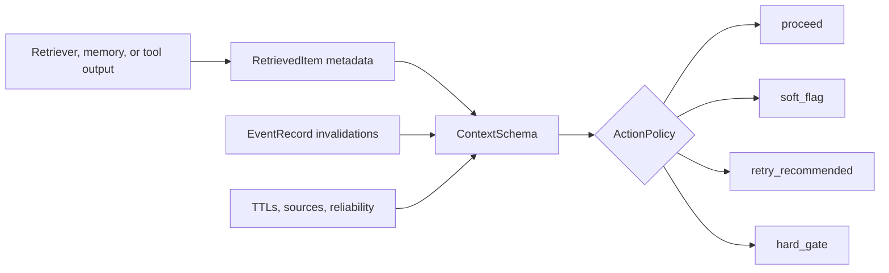
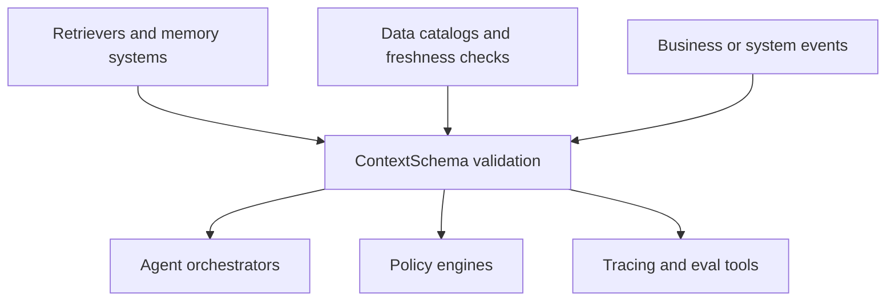

# ContextSchema

Validate retrieved context before AI agents act.

[](https://github.com/Novice-ninja/contextschema-py/actions/workflows/test.yml)

> Experimental pre-0.1 project. The core API is usable for examples and early
> review, but public API stability, package publishing, and integrations are
> still pending. Current package version: `0.0.1`.

ContextSchema is a small Python library for checking whether retrieved context is
fresh, provenance-backed, event-valid, source-appropriate, and complete enough
for a specific decision before an agent acts.

It is also a design-time contract: it forces PMs and engineers to declare what
context is enough, expected, stale, or unusable for a decision, instead of
assuming the agent will always receive perfect context.

It sits after retrieval and before action:

```text
retriever / memory / tool output -> ContextSchema -> proceed | soft_flag | retry_recommended | hard_gate
```

No runtime dependencies are required.

## At A Glance

| Question | Short Answer |
| --- | --- |
| What problem does it solve? | Retrieved context can be stale, incomplete, weakly sourced, or invalidated before an agent acts. |
| What design habit does it enforce? | Declare the context sufficiency boundary before relying on agent recommendations. |
| Where does it run? | After retrieval/tool output, before action/tool execution. |
| What does it return? | Field confidence, schema confidence, reasons, evidence, and an action recommendation. |
| What does it depend on? | Nothing at runtime. It accepts plain Python objects. |
| Does it replace my agent framework? | No. It is a small validation layer you call from your existing workflow. |

## Where It Fits



## What This Is

- A deterministic post-retrieval validation layer.
- A way to declare required decision fields with TTLs, sources, criticality, and invalidation events.
- A scoring and evidence layer for field confidence and whole-schema confidence.
- A small action recommendation surface for orchestrators and agent runtimes.
- A local JSONL-compatible evidence record that avoids storing raw retrieved text by default.

## What This Is Not

- Not a vector database.
- Not a retriever.
- Not an agent framework.
- Not a memory store.
- Not a data catalog.
- Not an observability platform.
- Not a policy engine like OPA/Cedar.
- Not an LLM classifier or extractor.

Those systems can feed or consume ContextSchema. The core library only answers:

> Is this retrieved context valid enough for this decision right now?

## Who Should Use This

Use ContextSchema if you are building:

- AI agents that take actions based on retrieved documents, memory, or tool output.
- RAG applications where stale or weakly sourced context can cause bad decisions.
- Customer-service, coding, finance, procurement, HR, sales, security, or ops agents
  that need a pre-action validity check.
- Evaluation or observability pipelines that need a compact, replayable evidence
  record for why an agent proceeded, retried, soft-flagged, or stopped.

You probably do not need it if your app only summarizes text, chats over static
documents, or never lets an agent take consequential actions.

For a scenario-driven explanation, including retail merchandising, customer
service, coding agents, finance, procurement, and security examples, see
[WHY_CONTEXTSCHEMA.md](WHY_CONTEXTSCHEMA.md).

## When To Use It

| Use ContextSchema When | Use Something Else When |
| --- | --- |
| You already have retrieved context and need to decide whether it is safe enough to act on. | You need to retrieve, rank, embed, or store documents. |
| Context freshness, provenance, or event invalidation affects the decision. | You only need output moderation or prompt guardrails. |
| You want deterministic reasons and evidence before an action runs. | You need a full tracing, dashboarding, or eval platform. |
| You want a small Python core that can sit inside an existing stack. | You want an end-to-end agent framework. |

## Compatibility With Existing Tools

ContextSchema is designed to be called from other systems, not to replace them.



| Tool Category | How It Fits |
| --- | --- |
| LangChain / LangGraph | Call `validate_retrieved()` in middleware, before a tool call, or before committing an agent action. |
| LlamaIndex | Validate retrieved nodes/documents after retrieval and before response synthesis or tool execution. |
| Redis / Zep / Mem0 | Treat memory or context-engine output as upstream context; pass timestamps, source refs, and reliability through metadata. |
| dbt / Great Expectations / Tecton / Feast | Use freshness, feature, or data-quality metadata as input signals for context fields. |
| OPA / Cedar / custom policy | Feed `result.to_policy_input()` into a policy layer if you want external allow/deny rules. |
| Langfuse / Braintrust / Phoenix / OpenTelemetry | Export or attach the evidence record after validation; ContextSchema is not an observability backend. |
| Agent scaffolds and internal platforms | Use it as a plain Python pre-action gate because it has no runtime dependencies. |

## Installation

From this repository:

```bash
git clone https://github.com/Novice-ninja/contextschema-py.git
cd contextschema-py
python3 -m venv .venv
source .venv/bin/activate
pip install -e .
```

Directly from GitHub:

```bash
pip install "git+https://github.com/Novice-ninja/contextschema-py.git"
```

For local test runs without installing:

```bash
PYTHONPATH=src python3 -m unittest discover -s tests -v
```

## Quickstart

```python
from datetime import UTC, datetime, timedelta

from contextschema import ActionPolicy, ContextField, ContextSchema, EventRecord, RetrievedItem


class BuyDecision(ContextSchema):
    schema_version = "1"
    action_policy = ActionPolicy(
        retry_below=0.75,
        soft_flag_below=0.75,
        hard_gate_on_event_invalidated_required_field=True,
    )

    inventory_available = ContextField(
        source=["inventory_api", "warehouse_snapshot"],
        ttl=timedelta(minutes=5),
        criticality=1.0,
        required=True,
        invalidates_on=["inventory_adjusted"],
    )

    current_price = ContextField(
        source="pricing_api",
        ttl=timedelta(minutes=15),
        criticality=1.0,
        required=True,
    )


items = [
    RetrievedItem(
        id="inv-1",
        text="2 units available",
        metadata={
            "context_field": "inventory_available",
            "source": "warehouse_snapshot",
            "source_ref": "warehouse:EWR-1:COAT-742",
            "valid_at": "2026-05-25T16:00:00Z",
        },
    ),
    RetrievedItem(
        id="price-1",
        text="$139.00",
        metadata={
            "context_field": "current_price",
            "source": "pricing_api",
            "source_ref": "pricebook:US:COAT-742",
            "valid_at": "2026-05-25T16:04:00Z",
        },
    ),
]

events = [
    EventRecord(
        event_id="evt-1",
        event_type="inventory_adjusted",
        occurred_at=datetime(2026, 5, 25, 16, 3, tzinfo=UTC),
        affected_fields=["inventory_available"],
        affected_sources=["warehouse_snapshot"],
        source_ref="warehouse:EWR-1:COAT-742",
    )
]

result = BuyDecision.validate_retrieved(
    items,
    decision_id="retail-buy-001",
    events=events,
    evaluated_at=datetime(2026, 5, 25, 16, 5, tzinfo=UTC),
)

print(result.action)
print(result.schema_confidence.score)
print(result.field("inventory_available").status)
print(result.to_policy_input())
```

Expected output starts with:

```text
hard_gate
0.0
event_invalidated
```

The inventory evidence was retrieved at `16:00`, then an
`inventory_adjusted` event happened at `16:03`, so the required field is no
longer valid for the buy decision.

## API Surface

| API | Purpose |
| --- | --- |
| `ContextSchema` | Base class for decision schemas. Define `ContextField` attributes and call `validate_retrieved()`. |
| `ContextField` | Field contract: source, TTL, requiredness, criticality, invalidation events, event policy, source reliability, privacy tags. |
| `RetrievedItem` | Normalized retrieved context item with `id`, optional `text`, and metadata. |
| `EventRecord` | Business or system event that may invalidate context after retrieval. |
| `ActionPolicy` | Maps field/schema confidence into `proceed`, `soft_flag`, `retry_recommended`, or `hard_gate`. |
| `ValidationResult` | Top-level result with field confidence, schema confidence, action, warnings, retry recommendations, and evidence. |
| `FieldConfidence` | Per-field score, status, component factors, reasons, matched item IDs, source refs, timestamps, invalidating events. |
| `SchemaConfidence` | Whole-decision score, aggregation method, weakest fields, missing required fields, event-invalidated fields. |
| `DecisionEvidenceLog` | Append-only JSONL writer for validation evidence records. |
| `ContextSchemaError` | Public exception raised for invalid schemas, fields, retrieved items, or event records. |
| `load_events_jsonl()` | Load event records from JSONL with strict or skip-bad-record behavior. |
| `explain_evidence()` | Lightweight human-readable explanation for a stored evidence record. |

Useful result helpers:

- `result.field("field_name")`
- `result.weak_fields(threshold=0.75)`
- `result.to_policy_input()`
- `result.to_dict()`
- `result.to_json()`

Stability notes for early users:

- `ContextSchemaError` is intentionally exported as the public package error.
- `ContextSchema.schema_definition()` is intended as the public schema export shape.
- `ValidationResult.to_policy_input()` is intended as the public pre-policy handoff shape.
- Because this is `0.0.1`, future releases may add fields or refine scoring behavior, but these names are the current public API boundary.

## Core Behavior

| Case | Behavior |
| --- | --- |
| Missing required field | Field score `0.0`, schema score capped at `0.0`, retry or hard gate depending on policy. |
| Missing optional field | Field status `missing_optional`, score `1.0`, schema not penalized. |
| Multiple candidates | Highest-scoring candidate is selected, all candidate IDs are reported with `ambiguous_multiple_candidates`. |
| Malformed timestamps | Ignored for matching; TTL-bound fields receive timestamp metadata penalties. |
| Event comparison impossible | Optional event policy warns only; required event policy reduces confidence. |
| Event invalidation | Matching events after evidence timestamp set event factor to `0.0`. |
| Weak source reliability | Field status becomes `weak_source`; retry can be recommended. |
| Raw retrieved text | Excluded from evidence by default; stored only with `store_raw_text=True`. |
| Empty schema | Raises `ContextSchemaError`. |
| Malformed event JSONL | Raises in strict mode; skips bad records with `strict=False`. |

## Examples

The `examples/` folder covers common enterprise agent use cases where an agent
may act on stale, incomplete, or invalidated context.

| Example | File |
| --- | --- |
| Customer service refund decision | `examples/customer_service_refund.py` |
| Coding agent code-change decision | `examples/coding_agent_change.py` |
| Sales opportunity next step | `examples/sales_opportunity_next_step.py` |
| Procurement vendor onboarding | `examples/procurement_vendor_onboarding.py` |
| Finance invoice approval | `examples/finance_invoice_approval.py` |
| HR leave-policy guidance | `examples/hr_employee_policy.py` |
| Security access review | `examples/security_access_review.py` |

Run all examples:

```bash
for file in examples/*.py; do
  echo "$file"
  PYTHONPATH=src python3 "$file"
done
```

More context: [examples/README.md](examples/README.md)

## Project Status And Releases

Current publishing target: public GitHub repository only.

PyPI publishing is deferred until the project reaches a tagged `0.1.0` release
candidate with a more stable public API, passing CI, and a clearer changelog.
Until then, install from GitHub or local checkout.

Helpful repo docs:

- [CHANGELOG.md](CHANGELOG.md)
- [CONTRIBUTING.md](CONTRIBUTING.md)
- [CODE_OF_CONDUCT.md](CODE_OF_CONDUCT.md)

## Research Notes

The long research ledgers are intentionally not part of this public package
repository. The public summary is in [RESEARCH.md](RESEARCH.md): it explains the
current positioning, what this package is not trying to replace, and why the
first release is a small post-retrieval validation library.

## Run Tests

```bash
PYTHONPATH=src python3 -m unittest discover -s tests -v
```

Current suite covers core scoring, event invalidation, ambiguity, weak sources,
evidence privacy defaults, JSONL loading, and all examples.

## License

MIT. See [LICENSE](LICENSE).

## Parked Scope

These are intentionally not part of the current core:

| Area | Current Decision |
| --- | --- |
| LangChain/LangGraph adapters | Deferred |
| LlamaIndex adapters | Deferred |
| Redis/Zep/Mem0 adapters | Deferred |
| dbt/GX/Tecton freshness imports | Deferred |
| OPA/Cedar export | Deferred |
| Langfuse/Braintrust/Phoenix export | Deferred |
| OpenTelemetry mapping | Deferred |
| LLM fallback extractor/classifier | Deferred |
| CLI | Deferred |
| YAML/JSON schema export | Deferred |
| Hosted service/dashboard | Rejected for MVP |
| PyPI release | Deferred |
